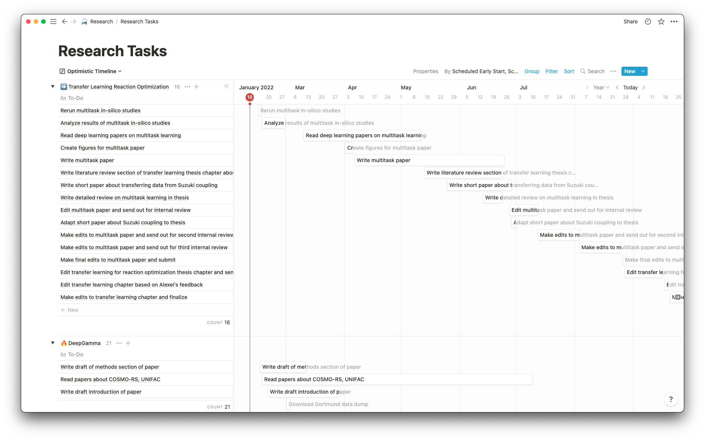

# Feazy

A fast way to break down long term goals into bite-sized tasks and keep yourself accountable to doing them.

Right now, feazy takes tasks in a [database in Notion](https://www.notion.so/kobifelton/89357b5cf7c749d6872a32636375b064?v=8d62d65e02754fbe84e94b2789d55e68) and schedules them using an optimization algorithm. Feazy takes into account deadlines, wait times (e.g., for feedback) and task dependencies.




## Installation

Install [poetry](https://python-poetry.org/) and then: 

```bash
poetry install
source`poetry env info --path`/bin/activate
```

If you are on anything other than a Apple M1 Mac, then ```poetry add ortools```. For Apple M1 Mac, follow the instructions to install [OR-tools from source](https://github.com/google/or-tools/issues/2722#issuecomment-1028221798).

## Running

You need to have a `.env` file with the your notion internal integration key set as `NOTION_TOKEN`. You can set up an internal integration [here](https://www.notion.so/my-integrations). Make sure to share the database with the integration.

To run the scheduling algorithm:

```bash
python run.py
```

## Setting it up to run on a schedule

On mac
1. Copy `static/com.feazy.run.plist` to `~/Library/LaunchAgents`
2. Change line 8 and line 21 to match the paths to `feazy.sh`. You can also change the time (default is to run daily at 12:30 PM)
2. Run `launchctl load ~/Library/LaunchAgents/com.feazy.run.plist`
3. Install terminal-notifier: `brew install terminal-notifier`
4. Run `chmod +x feazy.sh`


## Lessons on what worked and what didn't

What worked:
* **Using constraint programming in OR-tools**: After sampling pyomo and OR-tools, I definitely prefer the later. The constraint programming solver in OR-tools has a several convenience functions that make it easier to write scheduling algorithms. For example, OR-tools has a interval variable to represent time intervals and a function for specifying that intervals should not overlap. These capabilities have to be programmed by hand in pyomo.
* **Making all tasks optional**: Optional tasks sounds counterintuitive (I need to do all of the tasks to hit my goal), but I was running into issues where the problem was infeasible, and it wasn't clear why. Inspired by [this example](https://github.com/google/or-tools/blob/stable/ortools/sat/doc/scheduling.md#ranking-tasks-in-a-disjunctive-resource), I decided to introduce a boolean decision variable that allows the optimizer to include/exclude any task. In the current code, I maximize the number of active tasks and print any tasks that aren't being scheduled, so I can debug those tasks individually.
* **Breaking down tasks into smaller blocks**: I break down tasks into one hour blocks and schedule those; this disaggregation ensures that tasks can actually be scheduled in the available work hours even if they are longer than a given availability block. When the optimizer is finished, I consolidate the blocks into the original tasks. I assume that the optimizer fills every hour  up  (haven't checked explicitly), so I decrease my "work times" to 9 AM - 1PM to simulate that a good chunk of my day will be admin, meetings and browsing the internet. I also have a constraint that all blocks for a particular task have to be scheduled for that task to count as included.
* **Solving the multiobjective problem in two stages**: I tried several different objective formulations and found that it was best to first maximize the number of the active tasks before minimizing the total project time. See this [blog post](https://www.xiang.dev/cp-sat/#multiobjective-optimization) for a code example.
* **Syncing tasks with Notion**: The Notion API is well designed and its use in python is improved by [notion-py-sdk](https://github.com/ramnes/notion-sdk-py). I used the asynchronous version of the SDK for bulk uploading task schedules to Notion because it seemed faster.


What didn't work:
* **Pulling availability from Google calendar**: I tried creating availability based on my google calendar but kept running into problems with the algorithm I used to turn events into availability. I haven't completely given up on this because I believe my issues with this algorithm were mixed up with a bunch of other issues I later solved.

* ~~**Maximizing slack**: I tried to use ideas from the [critical path method](https://en.wikipedia.org/wiki/Critical_path_method) where each task has an associated early start and late start. This was causing all types of problems, but again, I haven't given up on the idea.~~
